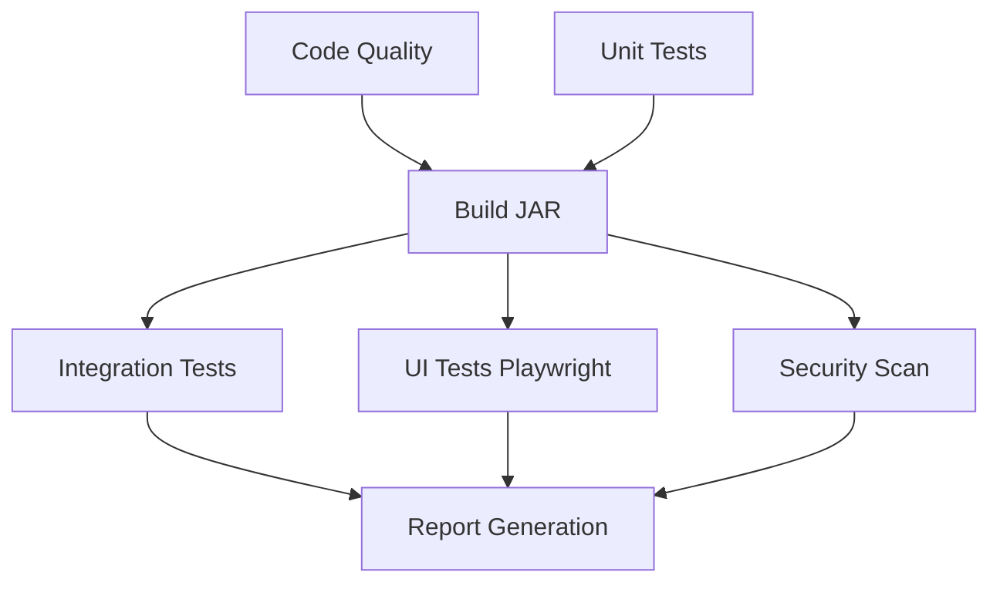

# Playwright UI Tests - GitHub Actions Integration

This document describes the integration of Playwright UI tests into the existing GitHub Actions CI/CD pipeline.

## Overview

The CI pipeline now includes a dedicated **UI Tests** stage that runs Playwright tests in parallel with other testing stages, providing comprehensive end-to-end validation of the user interface.

## Pipeline Architecture

### Stage Dependencies



### Pipeline Stages

1. **Unit Tests** (`test`) - Backend unit tests with Amper
2. **Code Quality** (`code-quality`) - ktlint and detekt analysis
3. **Build JAR** (`build-jar`) - Application packaging
4. **Integration Tests** (`integration-test`) - Backend integration tests
5. **UI Tests** (`ui-tests`) - **NEW** Playwright end-to-end tests
6. **Security Scan** (`security-scan`) - Dependency vulnerability scanning
7. **Report** (`report`) - Consolidated results summary

## UI Tests Stage Details

### Configuration

- **Runner**: `ubuntu-latest`
- **Dependencies**: Requires successful `build-jar` stage
- **Node.js**: Version 20 with npm caching
- **Browsers**: Chromium, Firefox, WebKit, Mobile Chrome, Mobile Safari

### Process Flow

1. **Environment Setup**
   - Checkout code
   - Set up JDK 21 and Node.js 20
   - Cache dependencies (Amper, npm, Playwright browsers)

2. **Dependency Installation**
   - Install Node.js dependencies (`npm ci`)
   - Install Playwright browsers with system dependencies

3. **Application Startup**
   - Start application in background with test profile
   - Wait up to 60 seconds for application to be ready
   - Validate application accessibility on `localhost:8080`

4. **Test Execution**
   - Run Playwright tests with `list` and `html` reporters
   - Execute tests across all configured browsers and viewports

5. **Cleanup & Reporting**
   - Stop application gracefully
   - Upload Playwright HTML reports and test results
   - Upload application logs if tests fail

### Test Coverage

- **Tab Interface Tests**: Tabbed note detail interface functionality
- **Responsive Design**: Desktop, tablet, and mobile layouts
- **UI Components**: Design system validation
- **Accessibility**: WCAG compliance and keyboard navigation
- **Dark Mode**: Theme switching and visual consistency

## Configuration Files

### GitHub Actions

**File**: `.github/workflows/ci.yml`

Key additions:
```yaml
ui-tests:
  name: UI Tests (Playwright)
  runs-on: ubuntu-latest
  needs: [build-jar]
  
  steps:
  - name: Set up Node.js
    uses: actions/setup-node@v4
    with:
      node-version: '20'
      cache: 'npm'
      
  - name: Install Playwright browsers
    run: npx playwright install --with-deps
    
  - name: Run Playwright UI tests
    run: npx playwright test --reporter=list,html
```

### Playwright Configuration

**File**: `playwright.config.ts`

CI-specific configuration:
```typescript
export default defineConfig({
  workers: process.env.CI ? 1 : undefined,
  webServer: process.env.CI ? undefined : {
    command: './amper run',
    url: 'http://localhost:8080',
    reuseExistingServer: true,
  },
});
```

### Make Commands

**File**: `Makefile`

New UI testing commands:
```makefile
test-ui:      # Run UI tests locally
test-ui-ci:   # Run UI tests with CI-friendly output
test-all:     # Run all tests (backend + UI)
```

## Local Development

### Running Tests Locally

```bash
# Install dependencies
npm install
npx playwright install

# Run all UI tests
make test-ui

# Run in headed mode (visible browser)
make test-ui-headed

# Debug tests
make test-ui-debug

# Run with CI output format
make test-ui-ci
```

### Test Development

Tests are located in `tests/playwright/`:
- `note-tabs.spec.ts` - Tab interface functionality
- `ui-components.spec.ts` - Design system components
- `responsive-design.spec.ts` - Cross-device layouts
- `accessibility.spec.ts` - WCAG compliance
- `dark-mode.spec.ts` - Theme switching

## CI Pipeline Benefits

### Comprehensive Testing

- **Cross-browser compatibility**: Tests run on Chromium, Firefox, and WebKit
- **Mobile responsive**: Validates mobile viewports (Pixel 5, iPhone 12)
- **Real user scenarios**: End-to-end workflows with actual UI interactions

### Developer Experience

- **Parallel execution**: UI tests run alongside other stages for faster feedback
- **Rich reporting**: HTML reports with screenshots and traces for failed tests
- **Artifact storage**: Test reports and application logs preserved for debugging

### Quality Assurance

- **Regression detection**: Catches UI regressions before deployment
- **Accessibility validation**: Ensures WCAG compliance
- **Visual consistency**: Validates design system implementation

## Monitoring & Debugging

### Artifacts Generated

1. **Playwright Report** (`playwright-report/`) - HTML test results
2. **Test Results** (`test-results/`) - Screenshots and traces
3. **Application Logs** (`app-logs-ui-tests`) - Server logs for failed tests

### Build Status

The pipeline generates a comprehensive build summary including:
- ✅ **UI Tests (Playwright)**: Passed/Failed status
- Integration with existing test results
- Downloadable artifacts for investigation

## Performance Considerations

### Optimization Features

- **Browser Caching**: Playwright browsers cached between runs
- **Dependency Caching**: npm packages and Amper dependencies cached
- **Sequential Workers**: Single worker in CI to prevent resource conflicts
- **Selective Retries**: Failed tests retried up to 2 times in CI

### Resource Management

- **Application Lifecycle**: Proper startup/shutdown handling
- **Timeout Management**: 60-second application startup timeout
- **Log Collection**: Application logs captured for debugging failures

## Future Enhancements

### Potential Improvements

1. **Visual Regression Testing**: Compare screenshots across builds
2. **Performance Testing**: Lighthouse integration for performance metrics
3. **API Mocking**: Mock external dependencies for stable tests
4. **Parallel Execution**: Browser-level parallelization when resources allow

### Maintenance Tasks

- **Browser Updates**: Keep Playwright browsers up-to-date
- **Test Coverage**: Expand test coverage for new UI features
- **Flaky Test Management**: Monitor and stabilize unreliable tests

## Troubleshooting

### Common Issues

1. **Application Startup Timeout**
   - Check application logs in artifacts
   - Verify database connectivity
   - Review Spring Boot configuration

2. **Browser Installation Failures**
   - Clear Playwright browser cache
   - Update Playwright version
   - Check system dependencies

3. **Test Flakiness**
   - Review wait strategies and timeouts
   - Check for race conditions
   - Validate element selectors

### Debug Commands

```bash
# Run specific test with debug
npx playwright test note-tabs.spec.ts --debug

# Generate and view report
npx playwright show-report

# Run with trace collection
npx playwright test --trace on
```